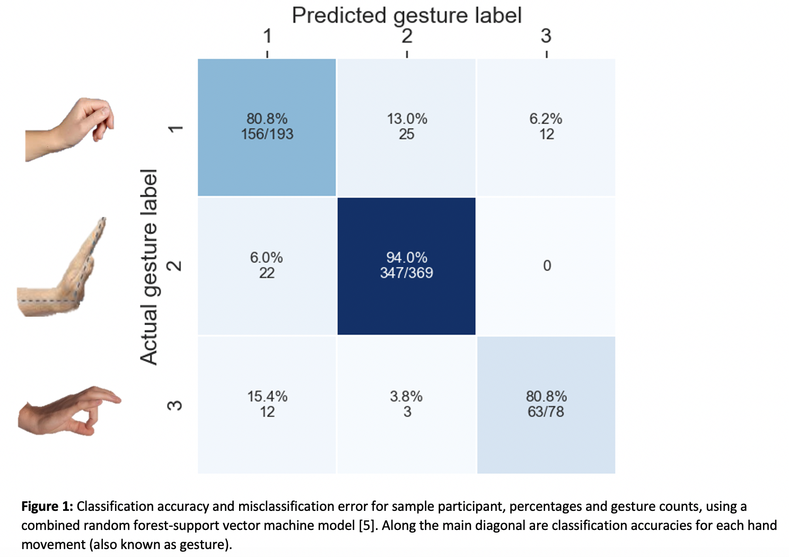

## It’s all in the wrist: classifying reach and grasp motions to improve hand function in young people with cerebral palsy via a personalized therapy video game

*Partial* data preprocessing and machine learning scripts from my 4-month research internship in hand gesture classification using EMG and IMU data from youth participants.  

The goal of this project is to design a reward-based therapeutic video game that integrates hand gesture recognition in real time for youths to practice three hand movements.

For privacy reasons the data is not published.

Sample confusion matrix shown below.

Tools used:

Python, MATLAB, H2O AutoML
